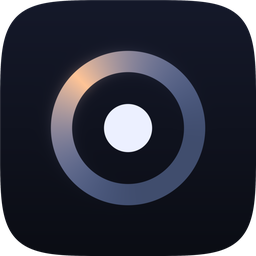
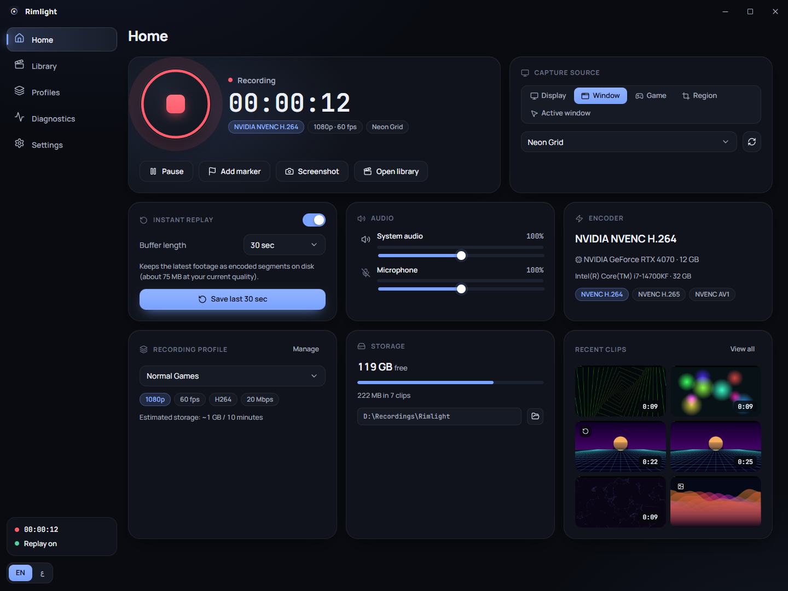
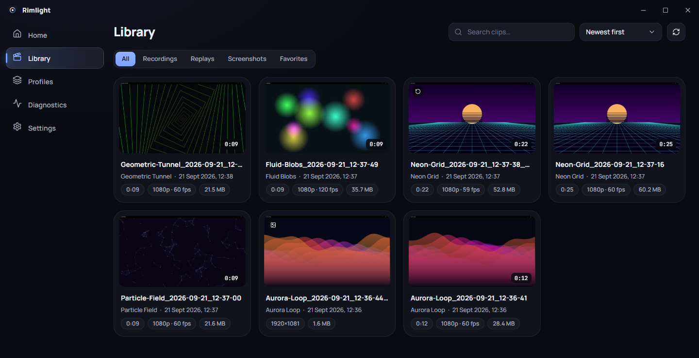
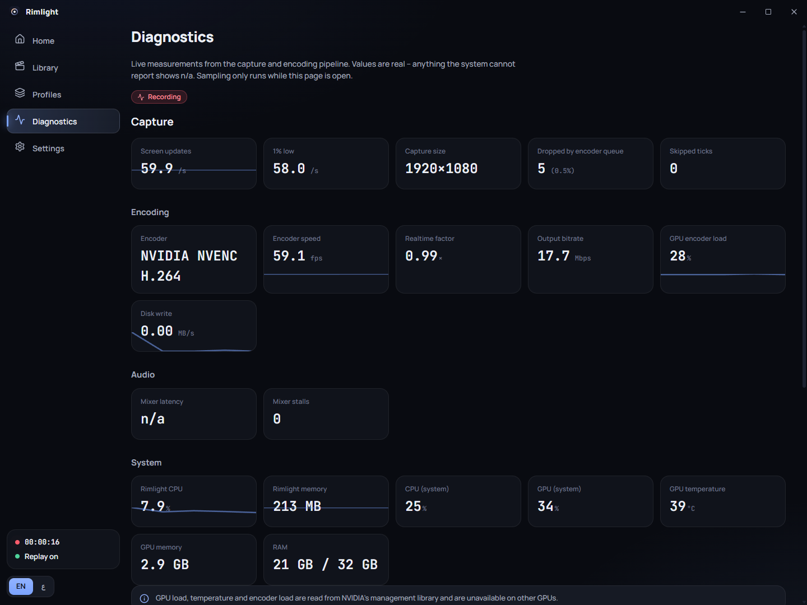
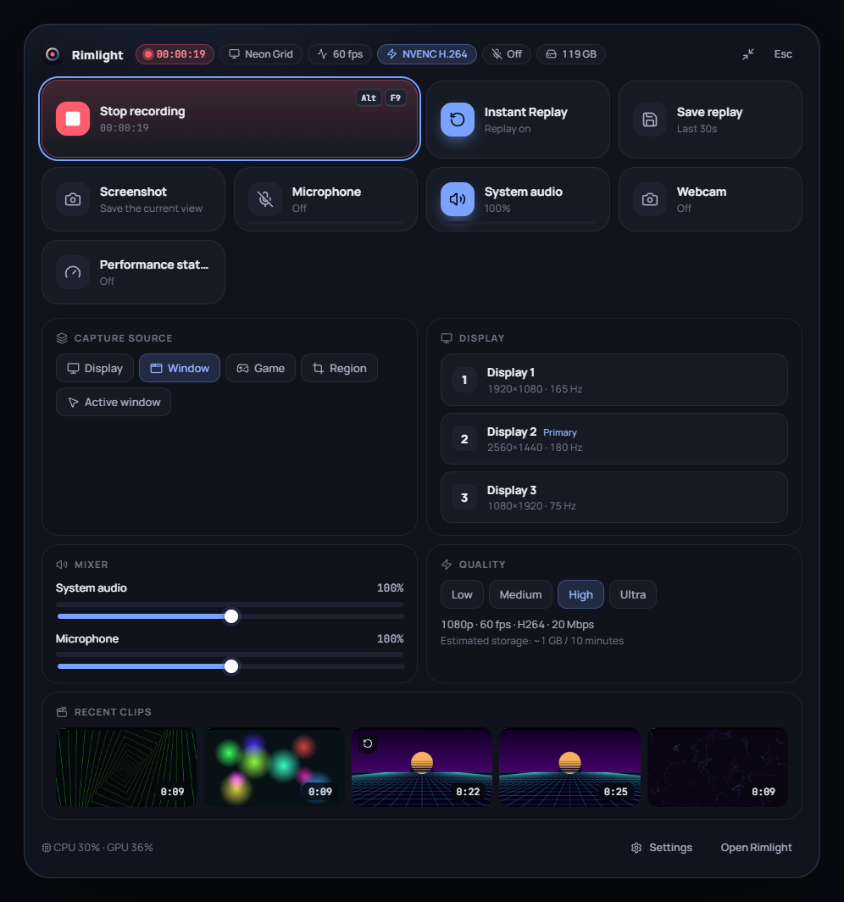
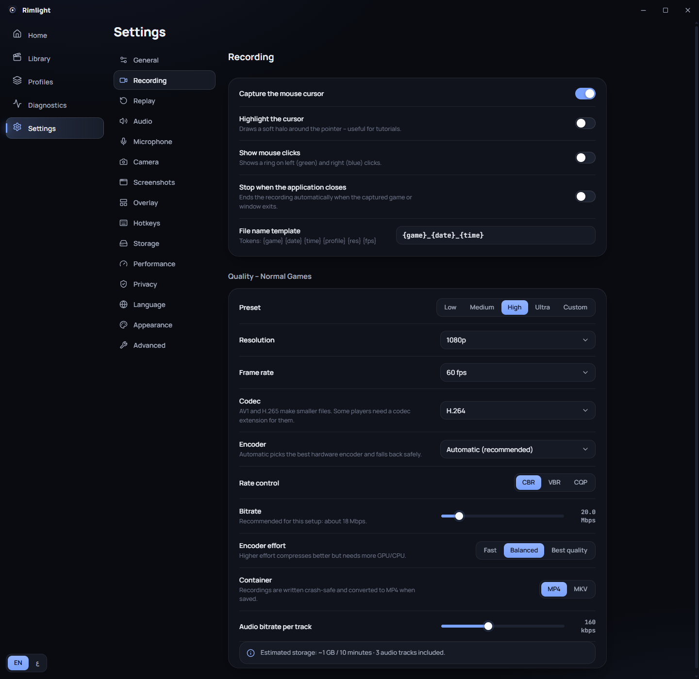
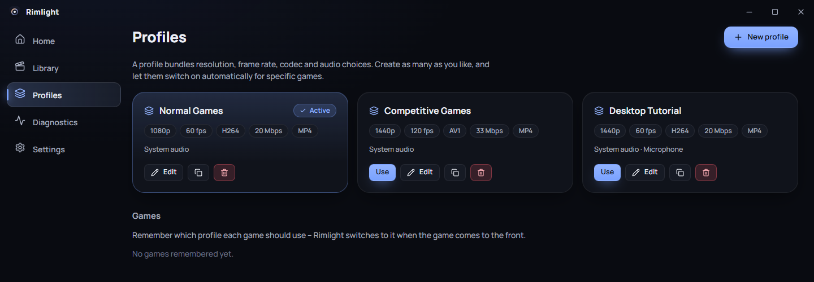
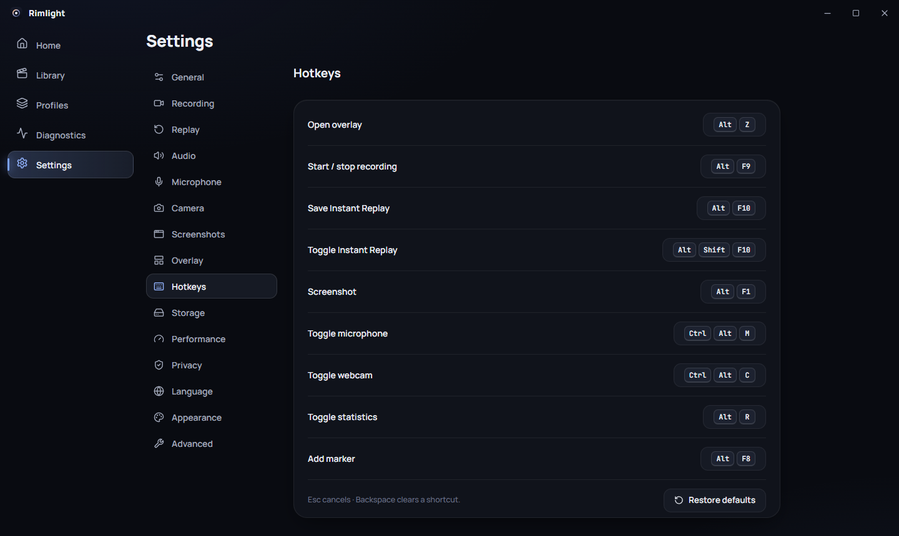
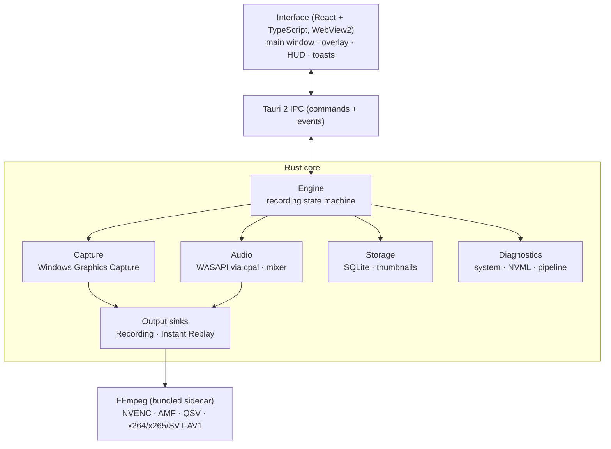

<div align="center">



# Rimlight

### Native Windows capture. Hardware-accelerated. Local-first.

Screen and gameplay recording, Instant Replay, a quick in-game overlay and a clip library —
in English and Arabic, with full right-to-left support.

<p>
  
  
  
  
  
  <a href="./LICENSE"></a>
</p>



</div>

---

## Contents

[Overview](#overview) · [Highlights](#highlights) · [Screenshots](#screenshots) · [Features](#features) · [Hardware encoding](#hardware-encoding) · [Architecture](#architecture) · [Keyboard shortcuts](#keyboard-shortcuts) · [Language support](#language-support) · [System requirements](#system-requirements) · [Installation](#installation) · [Development](#development) · [Building](#building-a-release) · [Project structure](#project-structure) · [Testing](#testing) · [Privacy](#privacy) · [Troubleshooting](#troubleshooting) · [Roadmap](#roadmap) · [Contributing](#contributing) · [License](#license)

## Overview

Rimlight is a native Windows capture application focused on screen and gameplay recording. It pairs a modern interface with hardware video encoding, a rolling **Instant Replay** buffer, a media library with generated thumbnails, live pipeline diagnostics and first-class Arabic/English localization.

The capture, audio and encoding pipeline runs in a Rust core, separate from the web-based interface. The UI can be closed, reloaded or crash without interrupting an active recording. Everything Rimlight produces stays on your machine.

## Highlights

| | |
|---|---|
| **Hardware-accelerated recording** | H.264, H.265 and AV1 through NVIDIA NVENC (verified), with AMD AMF, Intel Quick Sync and CPU encoders implemented. Every encoder is test-initialised at start-up, so the app only offers what actually works on your PC. |
| **Instant Replay** | A rolling buffer of already-encoded video (15 seconds to 20 minutes). Saving a replay joins segments without re-encoding, so it is near-instant. |
| **Quick overlay** | A modular command panel opened with a global shortcut, with keyboard navigation and controller support. It is excluded from recordings. |
| **Live diagnostics** | Capture rate, 1 % low, dropped frames, encoder speed and bitrate, plus CPU, RAM, GPU load, VRAM and temperature. Values the system cannot report are shown as *n/a*, never invented. |
| **Recording library** | Thumbnails, duration, resolution, frame rate and size for every clip, with search, sort, favorites, markers, a built-in player and a quick editor. |
| **English + Arabic (RTL)** | Arabic is a first-class interface language with a mirrored layout, not a translation bolted on. |

## Screenshots

All screenshots are of the real Windows release build, in English. The clips shown were recorded with Rimlight from animated demo windows.

### Dashboard

Start and stop recording, watch the timer and encoder, control Instant Replay, and pick the capture source.


### Library

Real recordings, replays and screenshots with generated cover images and metadata.



### Diagnostics

Measurements from the live capture and encoding pipeline.



### Quick overlay

Opened with a global shortcut above your game or desktop. It supports keyboard navigation, and controller navigation through the browser Gamepad API.

<div align="center">

</div>

### Recording settings

Resolution, frame rate, codec, encoder, rate control, bitrate and container, with a storage estimate.

<div align="center">

</div>

<details>
<summary><b>More screens</b> — profiles and hotkeys</summary>

<br />

**Profiles** bundle quality and audio choices and can activate automatically for specific games.



**Hotkeys** are global, configurable, and checked for conflicts.



</details>

## Features

### Capture

- **Display, window, region and active-window capture**, plus automatic **game detection**, using the Windows Graphics Capture API.
- Multi-monitor support with quick display switching.
- Constant frame-rate output up to 144 fps, driven by a monotonic clock so long recordings stay in sync.
- Screenshots as PNG, JPEG or WebP, with an optional delay timer, cursor capture and copy-to-clipboard.
- Cursor options: capture, highlight, and click indicators.
- Automatic stop when the captured application closes.

### Encoding

- H.264, H.265 (HEVC) and AV1, with CBR, VBR and constant-quality (CQP) rate control.
- Presets (Low, Medium, High, Ultra) or fully custom resolution, frame rate, bitrate, encoder effort and container (MP4 or MKV).
- Automatic fallback to the next available encoder if one fails to start.
- Recordings are written crash-safe (Matroska) and converted to MP4 on stop. A saved file is only reported after it has been re-opened and validated.
- Interrupted recordings are detected at the next launch and can be recovered.

### Instant Replay

- Keeps the last 15 seconds to 20 minutes (or a custom length) as encoded segments in a temporary folder.
- Saving concatenates the newest segments without re-encoding, including the segment still being written.
- Runs independently of manual recording, so both can be active at once.

### Audio

- **System audio** (WASAPI loopback) and **microphone**, each with device selection and independent volume.
- Up to three audio tracks per file: full mix, system audio and microphone.
- Microphone processing: gain, noise gate, compressor, limiter, push-to-talk and push-to-mute, with live level meters.
- Devices can be unplugged and replaced during use; Rimlight falls back to the default device.

### Library and editing

- SQLite-backed library with thumbnails, search, sorting, favorites, notes and rename.
- Markers can be added during a recording and appear on the player timeline.
- Built-in player with playback speed, volume and fullscreen.
- Quick editor: trim, crop presets, rotate, mute or adjust volume, and add a text overlay. Edits are always exported as a **new file**.

### Diagnostics

- Capture rate, 1 % low, capture size, dropped frames, encoder speed, real-time factor and output bitrate.
- CPU, RAM, GPU load, VRAM and GPU temperature (GPU metrics use NVIDIA's management library and require an NVIDIA GPU).

### Everyday use

- **Profiles** with per-game automatic activation.
- **Tray** menu with recording state, launch with Windows (normal, minimized or tray-only).
- **Privacy**: protected applications can be covered or cause a pause; optional suppression of Windows notifications while recording.
- Four themes (Midnight, Graphite, OLED Black, Dark Glass), accent colors and interface scaling.
- Local rotating logs, opened from Settings → Advanced.

## Hardware encoding

Rimlight bundles FFmpeg and, at start-up, actually initialises each encoder relevant to your GPU. The list in **Settings → Advanced** shows the real result and failure reason for each.

| Vendor | Encoder | Codecs | Status |
|---|---|---|---|
| NVIDIA | NVENC | H.264, H.265, AV1 | Verified on a GeForce RTX 4070 |
| AMD | AMF | H.264, H.265, AV1 | Implemented and probed; not yet verified on AMD hardware |
| Intel | Quick Sync | H.264, H.265, AV1 | Implemented and probed; not yet verified on Intel hardware |
| CPU | x264, x265, SVT-AV1 | H.264, H.265, AV1 | Verified |

AV1 hardware encoding requires a GPU that supports it (for example NVIDIA RTX 40-series).

## Architecture



| Layer | Technology |
|---|---|
| Interface | React 18, TypeScript, Vite, Zustand |
| Desktop shell | Tauri 2 |
| Core | Rust — `windows-capture` (Windows Graphics Capture), `cpal` (WASAPI), `rusqlite` (SQLite), `sysinfo` and NVML for telemetry |
| Encoding | FFmpeg sidecar, one process per output |
| Library data | SQLite; media files stay on disk and are referenced by path |

### Design principles

- **The engine does not depend on the UI.** Capture, mixing and encoding run on native threads and separate FFmpeg processes, so a UI reload or crash does not interrupt a recording.
- **Constant frame rate from an irregular source.** Windows only delivers frames when the picture changes; a regulator turns that into an exact frame-rate stream and feeds each output.
- **Independent outputs.** Recording and Instant Replay are separate encoders on the same capture.
- **Encoded rolling buffer.** Instant Replay stores encoded segments rather than raw frames, keeping disk and memory use predictable.
- **Safe finalization.** Recordings are validated after they are written, and interrupted sessions can be recovered.
- **Rendering does not wait on animation.** Page navigation is synchronous, so the interface stays usable even when the WebView pauses drawing.
- **Asynchronous thumbnails.** Cover images are generated in the background, validated, cached in `%LOCALAPPDATA%\Rimlight\thumbnails`, and regenerated automatically if missing or invalid.
- **Work only when needed.** Statistics, level meters and watchers run only while something is using them.

## Keyboard shortcuts

Defaults are global (they work inside games) and can be changed in **Settings → Hotkeys**, which also detects conflicts with other actions and other applications.

| Action | Default shortcut |
|---|---|
| Open overlay | `Alt` + `Z` |
| Start / stop recording | `Alt` + `F9` |
| Save Instant Replay | `Alt` + `F10` |
| Toggle Instant Replay | `Alt` + `Shift` + `F10` |
| Screenshot | `Alt` + `F1` |
| Toggle microphone | `Ctrl` + `Alt` + `M` |
| Toggle webcam | `Ctrl` + `Alt` + `C` |
| Toggle statistics | `Alt` + `R` |
| Add marker | `Alt` + `F8` |

## Language support

Rimlight ships in **English** and **Arabic**. Arabic is treated as a first-class interface language rather than a translated afterthought:

- Layout, navigation, panels, dialogs, toasts and the overlay mirror for right-to-left reading, using logical CSS properties throughout.
- Arabic uses a dedicated typeface (IBM Plex Sans Arabic); numbers and timers stay left-to-right.
- The language switches instantly, applies to every window including the overlay, and is remembered.
- Translations are typed: the Arabic dictionary must define every English key, so a missing translation fails the build. Tests also check placeholder parity.

## System requirements

- Windows 10 or Windows 11, x64. Rimlight has been developed and tested on Windows 11.
- The Microsoft Edge WebView2 runtime (already present on current Windows; the installer downloads it if missing).
- For hardware encoding, a GPU with a supported video encoder and a current driver. CPU encoding is available as a fallback.
- Disk space for your recordings. As a guide, the default profile (1080p60 H.264 at 20 Mbps) uses roughly 1 GB per 10 minutes; the app shows a live estimate for your settings.

## Installation

Prebuilt releases have not been published yet. Until they are, build the installer yourself by following [Building a release](#building-a-release), then run the generated `Rimlight_0.1.0_x64-setup.exe`.

The installer is per-user, adds a Start Menu shortcut and an uninstaller, and is currently unsigned, so Windows SmartScreen may ask for confirmation.

## Development

### Prerequisites

- [Node.js](https://nodejs.org) 20 or newer
- [Rust](https://rustup.rs) (stable, MSVC toolchain)
- Visual Studio Build Tools with the **Desktop development with C++** workload and a Windows SDK
- The [Tauri 2 prerequisites for Windows](https://tauri.app/start/prerequisites/)

### Run

```bash
git clone <repository-url>
cd rimlight

npm install
npm run fetch:ffmpeg      # downloads the FFmpeg sidecar into src-tauri/binaries
npm run tauri dev         # Vite + Rust with hot reload
```

`npm run dev` on its own starts only the interface in a normal browser using fixture data (development mock), which is useful for design work.

## Building a release

```bash
npm run fetch:ffmpeg
npm run bundle            # runs `tauri build`
```

The Windows installer is written to:

```
src-tauri/target/release/bundle/nsis/Rimlight_0.1.0_x64-setup.exe
```

and the application binary to `src-tauri/target/release/rimlight.exe`.

## Project structure

```
rimlight/
├── src/                     # Interface
│   ├── components/          # Design system: controls, dialogs, feedback
│   ├── features/            # Home, library, overlay, HUD, settings, onboarding …
│   ├── pages/               # Home, Library, Profiles, Diagnostics, Settings
│   ├── stores/              # Zustand stores (settings, recording, library, devices, UI)
│   ├── i18n/                # en.ts and ar.ts (typed keys)
│   ├── hooks/  lib/         # Shared hooks, IPC client, formatting utilities
│   └── styles/              # Design tokens and component styles
├── src-tauri/
│   ├── src/
│   │   ├── engine/          # Recording, replay, finalization, supervision
│   │   ├── capture/         # Windows Graphics Capture, frame pool, regulator
│   │   ├── audio/           # WASAPI capture, mixer, DSP
│   │   ├── encoder/         # FFmpeg discovery, probing, command builder
│   │   ├── replay/          # Rolling-buffer segment logic
│   │   ├── system/          # Hardware, monitors, windows, statistics
│   │   └── …                # db, hotkeys, shell (windows/tray), thumbnails, screenshots
│   ├── capabilities/        # Tauri permissions
│   └── tauri.conf.json
├── docs/images/             # README screenshots
└── scripts/                 # Tooling (FFmpeg fetch, icon generation, test harnesses)
```

## Testing

```bash
# Interface
npm run typecheck
npm run lint
npm test

# Native core
cd src-tauri
cargo fmt --check
cargo clippy --lib
cargo test --lib
```

Results at the time of writing:

| Check | Result |
|---|---|
| TypeScript tests (Vitest) | 25 passing (4 test files) |
| Rust tests | 85 passing |
| `tsc`, ESLint, `cargo fmt --check` | clean |
| `cargo clippy --lib` | no errors (style-level warnings only) |
| Release build and NSIS installer | succeeds after `cargo clean`; installer is about 99 MB |

Tests cover settings, profiles, file naming, localization, the recording state machine, hotkey parsing and conflicts, the library database, storage calculations, the replay buffer, the FFmpeg command builder, audio DSP and thumbnail validation.

### End-to-end self-test

```bash
src-tauri/target/release/rimlight.exe --selftest
```

Starts Instant Replay and a recording of **your real screen**, adds a marker, takes a screenshot, saves a replay, pauses and resumes, then validates the produced files with ffprobe. It removes everything it created and exits with code `0` on success.

## Privacy

- Recordings, screenshots, thumbnails and settings are stored **locally** and never uploaded.
- No account is required and no telemetry is collected.
- Rimlight only records when you start a recording, enable Instant Replay, or take a screenshot.
- The only network request the app can make is the **optional** update check, and only to a feed URL you configure yourself. It is off by default.
- Protected applications can be excluded from capture (covered or paused) in Settings → Privacy.

## Troubleshooting

**The microphone is not recorded.** Open Settings → Microphone, make sure the microphone is switched on and the right device is selected, and check Windows *Privacy & security → Microphone* permissions. The level meter should move when you speak.

**A hardware encoder is unavailable.** Settings → Advanced shows the failure reason for each encoder. Update your GPU driver, or choose CPU encoding in the recording settings. Rimlight falls back automatically if an encoder fails to start.

**Window capture fails or shows nothing.** Restore the window if it is minimized, or switch to display capture. Windows delivers no frames for minimized or protected windows.

**The overlay does not appear over a game.** Use borderless or windowed fullscreen. Exclusive-fullscreen mode cannot show any overlay window, though capture itself still works.

**A thumbnail is missing.** Thumbnails are validated and regenerated automatically when the library loads. Use the refresh button in the Library to rescan.

**A shortcut does nothing.** Settings → Hotkeys shows a status for each shortcut; another application may already own it.

## Roadmap

The items below are **not implemented yet**.

- Fix Instant Replay when AV1 is selected. Replay segments currently use MPEG-TS, which cannot carry AV1; H.264 and H.265 replays work.
- Per-application audio tracks (for example a separate track for a game or voice chat).
- Noise suppression for the microphone.
- Live streaming (RTMP). The engine is built around independent outputs so it can be added without touching recording.
- Live webcam preview. The webcam overlay is implemented but currently has no preview, so check it with a short test recording.
- Dragging clips out of the library into other applications.
- Arabic text in the editor's text overlay.

Known limitations: game frame rate is measured from captured frame delivery rather than the game's swap chain, and GPU load, VRAM and temperature require an NVIDIA GPU.

## Contributing

Contributions are welcome.

1. Fork the repository and create a branch for your change.
2. Make your change, keeping user-facing text in both `src/i18n/en.ts` and `src/i18n/ar.ts`.
3. Run the checks listed under [Testing](#testing) and add tests for new logic.
4. Open a pull request describing what changed and why.

## License

Rimlight is released under the [MIT License](./LICENSE).

The installer bundles an **FFmpeg GPL build** (which includes x264 and x265). If you redistribute Rimlight, review the FFmpeg licensing terms that apply to that build. Interface fonts — Manrope, IBM Plex Sans Arabic and JetBrains Mono — are distributed under the SIL Open Font License.
